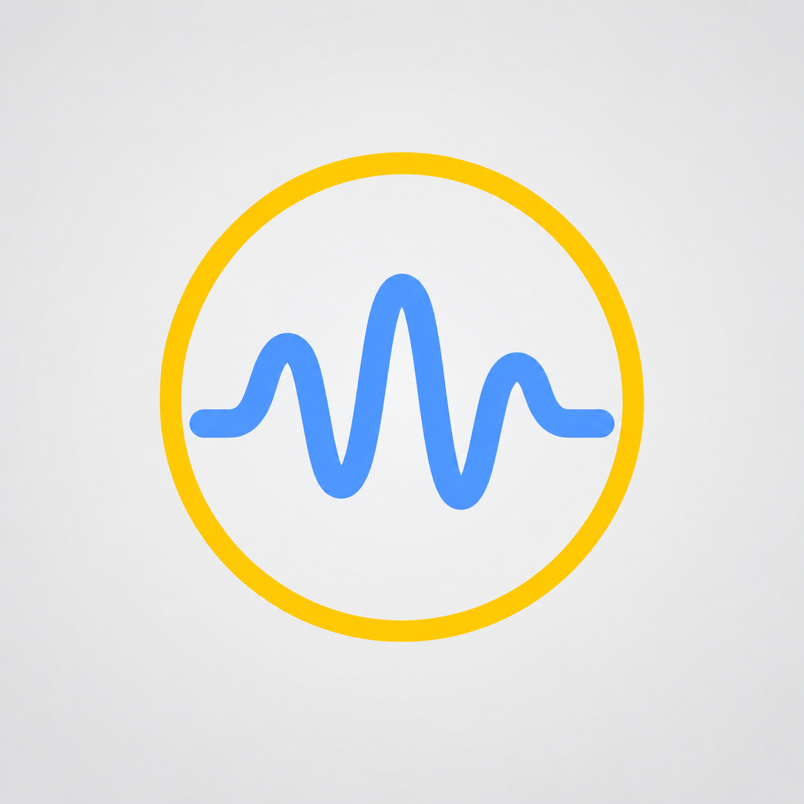

# Sound Monitor

An Android Flutter app for live sound-level estimates, graphs, and locally saved
measurements with audio playback. No account or cloud service is required.



## What you need

- Android 7.0 (API 24) or newer, with a microphone.
- The included APK supports ARM32, ARM64, and x86-64 devices.

## Download and install

[Download the Android APK](sound-level-monitor-release.apk?raw=true).
Open it on your phone and allow installation from your browser or file manager
when Android asks.

The APK is built in **release mode** and signed with a **development key** for
direct testing. It is not an official app-store release. A different signing
key cannot update an existing installation; export recordings before uninstalling.

Optional download integrity check using [SHA256SUMS](SHA256SUMS):

```sh
sha256sum -c SHA256SUMS
```

## Use the app

1. Tap **Play** and allow microphone access. Audio records automatically during
   each measurement.
2. Use **Graph** to switch between Time history, Spectrum, and Live level.
   Meter settings include A/C/Z weighting, time response, and light/dark themes.
   **Calibrate** adjusts the manual reading offset.
3. **Pause** keeps the unsaved session for resuming. **Save** pauses and stores
   the summary, audio, and timeline in History. **Reset** discards the unsaved session.
4. Open **History** and select a session. The **Saved audio** page provides
   playback, seeking, and five-second skips, followed by statistics and details.
   Use the pencil to rename, **Export WAV** to save an audio copy, **Share** to
   share it, or **Delete recording** to remove the saved session and its audio.

Leaving the app pauses monitoring; returning resumes only a previously active
measurement. Changing weighting, response, or calibration starts a
fresh statistics window while the session timer continues. Older sessions
without playable audio still show their saved summaries.

## Accuracy and privacy

Displayed dB values are **phone-microphone estimates**. Manual calibration does
not certify accuracy. Do not use the app for hearing-safety, workplace, or
regulatory decisions.

Recordings and measurements stay in private device storage; the app does not
automatically upload them. Exporting and sharing happen only when selected.
Closing the app can lose unsaved sessions; retry a failed Save before closing.
Uninstalling removes private recordings, while exported copies remain.

## Run from source

Install Flutter and the Android SDK. Local development uses Flutter 3.44.8 and
Dart 3.12.2. Connect an Android phone with USB debugging enabled, then run:

```sh
flutter pub get
flutter devices
flutter run -d DEVICE_ID
```

Replace `DEVICE_ID` with your phone's ID. Android is the supported target.

## Build and verify

```sh
dart format --output=none --set-exit-if-changed lib test
flutter analyze
flutter test
flutter build apk --release
```

Refresh the download included in the repository after a successful build:

```sh
cp build/app/outputs/flutter-apk/app-release.apk sound-level-monitor-release.apk
sha256sum sound-level-monitor-release.apk > SHA256SUMS
```

Release builds currently use the Android **debug signing key**. Keep Android
version codes increasing for updates. Configure a unique application ID and a
private release key before store distribution; never commit signing keys.

Automated checks cover processing, storage, session lifecycle, and UI behavior.
Physical microphone, recording/pause/resume, playback/seek, export/share, and
both themes still need phone verification before wider distribution.

## License

[MIT](LICENSE).
